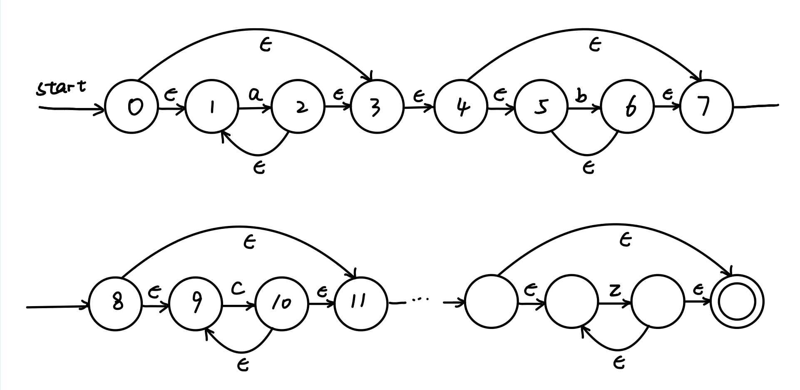
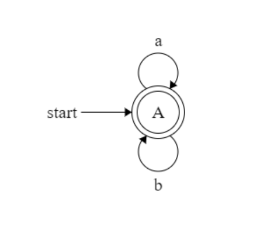

# 编译原理第一次作业

`201300066 麻超`

### Ex. 3.3.1

* Unicode
* 数字常量值有三种类型：
  * 整数字面值：又分为十进制整数、二进制整数、八进制整数、十六进制整数，十进制整数除了0以外，是以非0数字开头，只包含0-9或者下划线的常量，二进制整数以"0b"或者"0B"开头，只包含0和1或者下划线，八进制整数以"0o"或者"0O"开头，只包含0-7或者下划线，十六进制整数以"0x"或者"0X"开头，只包含数字0-9，或者"a-f"或者"A-F"，或者下划线的量。
  * 浮点数字面值：包含小数型和指数型，其中小数型由0-9数字加上小数点再加上0-9数字或者0-9数字加上小数点（如100.）组成，指数型由0-9整数或者小数型开始，加上e或者E，再加上"+"或者"-"，再加上0-9组成的数字。
  * 虚数由浮点数或者0-9的数字开始，加上j或者J即可。
  * 注意以上三种都可以用下划线来分割数字。
* 有效标识符字符为： 大小写字母 A 至 Z、下划线 _ 、数字 0 至 9，但不能以数字开头。
### Ex. 3.3.2 -2)

所有由a和b组成的字符串

### Ex. 3.3.5 -2)

$a^* b^* c^*...y^* z^*$

### Ex. 3.6.2

### Ex. 3.6.3

* (0)a$\rightarrow$(0)a$\rightarrow$(0)b$\rightarrow$(0)b$\rightarrow$(0)
* (0)a$\rightarrow$(1)a$\rightarrow$(1)b$\rightarrow$(1)b$\rightarrow$(1)
* (0)a$\rightarrow$(1)a$\rightarrow$(2)b$\rightarrow$(2)b$\rightarrow$(2)
* (0)a$\rightarrow$(0)a$\rightarrow$(1)b$\rightarrow$(1)b$\rightarrow$(1)
* (0)a$\rightarrow$(1)a$\rightarrow$(2)b$\rightarrow$(2)b$\rightarrow$((3))
* (0)a$\rightarrow$(1)a$\rightarrow$(2)$\epsilon\rightarrow$(0)b$\rightarrow$(0)b$\rightarrow$(0)
* (0)a$\rightarrow$(1)a$\rightarrow$(2)b$\rightarrow$(2)$\epsilon\rightarrow$(0)b$\rightarrow$(0)

该NFA接受aabb

### Ex. 3.6.5-1)

| 状态 | a        | b        | $\epsilon$ |
| ---- | -------- | -------- | ---------- |
| 0    | {0,1}    | {0}      | $\empty$   |
| 1    | {1,2}    | {1}      | {0}        |
| 2    | {2}      | {2,3}    | $\empty$   |
| 3    | $\empty$ | $\empty$ | $\empty$   |

### Ex. 3.7.1-3)

