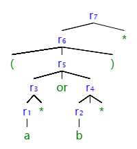
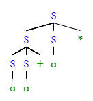

# 编译原理第二次作业

`201300066 麻超`

### Ex. 3.7.3-2

首先需要得到其语法分析树，如下：

对子表达式构造NFA.

$r_1,r_2,r_3,r_4,r_5$（$r_6$的NFA与$r_5$相同）的NFA分别如下：

故得到$r_7$的NFA如下：

根据NFA求DFA，其转换表如下：

| NFA状态                 | DFA状态 | a   | b   |
| ----------------------- | ------- | --- | --- |
| {0,1,2,3,4,5,8,9,10,11} | A       | B   | C   |
| {1,2,3,4,5,6,8,9,10,11} | B       | B   | C   |
| {1,2,3,4,5,7,8,9,10,11} | C       | B   | C   |

DFA如下：

### Ex. 4.2.1

##### 1) 

$S\underset{lm}{\Longrightarrow}SS^*\underset{lm}{\Longrightarrow}SS+S^*\underset{lm}{\Longrightarrow}aS+S^*\\ \underset{lm}{\Longrightarrow}aa+S^*\underset{lm}{\Longrightarrow}aa+a^*$

##### 2) 

$S\underset{rm}{\Longrightarrow}SS^*\underset{rm}{\Longrightarrow}Sa^*\underset{rm}{\Longrightarrow}SS+a^*\\ \underset{rm}{\Longrightarrow}Sa+a^*\underset{rm}{\Longrightarrow}aa+a^*$

##### 3）

##### 4)

该文法不是二义性的。对于所有的句子，都不存在超过一个的最左或最右推导，故不具有二义性。

##### 5）

所有的加法和乘法的集合组成的后缀表达式
### Ex. 4.2.3-1

其正则表达式为$((01)|1)^*$，故得到其文法如下：

$S\rightarrow LS|\epsilon\\
L\rightarrow 01|1$

